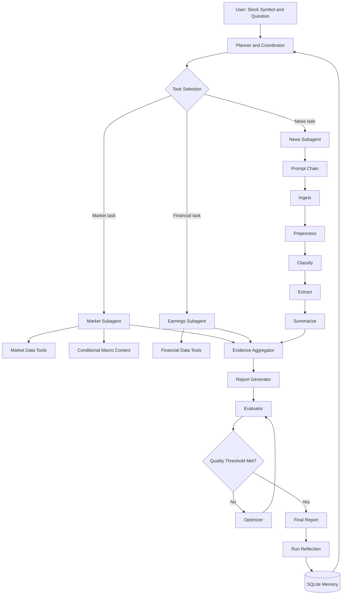

# Agentic AI for Autonomous Investment Research

A Python-based autonomous investment research system that plans research tasks, dynamically selects tools and specialist subagents, analyzes market, financial, and news data, evaluates its own output, improves weak sections, and learns across runs.

## Project Objectives

The project demonstrates the following required capabilities.

### Workflow Patterns

1. **Prompt Chaining**
   - Ingest News
   - Preprocess
   - Classify
   - Extract
   - Summarize

2. **Routing**
   - The Planner assigns research tasks to the appropriate specialist subagents.
   - Routing is implemented inside the Planner, so a separate Router Agent is not required.

3. **Evaluator–Optimizer**
   - Generate an initial report.
   - Evaluate the report using a quality rubric.
   - Refine weak sections using evaluator feedback.
   - Re-evaluate until the quality threshold or maximum cycle count is reached.

### Autonomous Agent Functions

1. **Planning**
2. **Dynamic Tool Use**
3. **Self-Reflection**
4. **Learning Across Runs**

## High-Level Architecture



## Repository Structure

```text
investment-research-agent/
├── investment_research_agent.ipynb
├── README.md
├── architecture.md
├── prd_and_engineer_plans.md
├── requirements.txt
├── .env.example
├── .gitignore
├── agent_memory.db
├── src/
│   ├── __init__.py
│   ├── config.py
│   ├── models.py
│   ├── planner.py
│   ├── orchestrator.py
│   ├── tool_registry.py
│   ├── market_agent.py
│   ├── earnings_agent.py
│   ├── news_agent.py
│   ├── news_pipeline.py
│   ├── data_tools.py
│   ├── macro_context.py
│   ├── evidence.py
│   ├── report_generator.py
│   ├── evaluator.py
│   ├── optimizer.py
│   ├── reflection.py
│   ├── memory.py
│   ├── visualizations.py
│   └── utils.py
├── prompts/
│   ├── planner.txt
│   ├── news_classifier.txt
│   ├── news_extractor.txt
│   ├── news_summarizer.txt
│   ├── report_generator.txt
│   ├── evaluator.txt
│   └── optimizer.txt
├── tests/
│   ├── test_planner.py
│   ├── test_routing.py
│   ├── test_tools.py
│   ├── test_market_agent.py
│   ├── test_earnings_agent.py
│   ├── test_news_pipeline.py
│   ├── test_evaluator.py
│   └── test_memory.py
├── data/
│   ├── cache/
│   └── samples/
└── outputs/
    ├── reports/
    ├── charts/
    └── logs/
```

## Project Modules

### `src/config.py`

Central configuration for:

- Stock symbol and benchmark
- Research period
- News lookback period
- Maximum news article count
- Quality threshold
- Maximum refinement cycles
- API keys and model configuration
- Cache, database, and output paths

### `src/models.py`

Contains shared structured models or dataclasses:

- `AgentState`
- `ResearchPlan`
- `ResearchStep`
- `RoutingDecision`
- `ToolCallResult`
- `SubagentResult`
- `EvidenceItem`
- `NewsArticle`
- `ExtractedNewsEvent`
- `ResearchReport`
- `EvaluationResult`
- `MemoryItem`

All agents should use these common models to avoid incompatible outputs.

### `src/planner.py`

Responsible for:

- Interpreting the research question
- Retrieving relevant memory
- Decomposing the request into tasks
- Selecting the required subagents
- Recording selected and skipped subagents
- Generating dependencies and completion criteria

The Planner also performs routing. It must not call every subagent for every request.

### `src/orchestrator.py`

Responsible for:

- Creating and maintaining `AgentState`
- Executing the research plan
- Calling selected subagents
- Managing task dependencies
- Handling skipped or failed steps
- Collecting specialist outputs
- Starting report generation and evaluation

### `src/tool_registry.py`

Maintains approved tools and their callable Python functions.

Typical registered tools:

- Company profile retrieval
- Historical market prices
- Benchmark prices
- Financial statements
- News retrieval
- SEC filings, optional
- Macro data, optional
- Memory retrieval
- Memory storage

Each tool call should record its arguments, status, duration, output summary, and error details.

### `src/data_tools.py`

Implements data-source functions:

- `get_company_profile()`
- `get_price_history()`
- `get_benchmark_history()`
- `get_financial_statements()`
- `get_company_news()`
- `get_sec_filings()`
- `get_macro_series()`

The functions should return normalized Python objects or Pandas DataFrames rather than raw provider responses.

### `src/market_agent.py`

Performs:

- Historical-price analysis
- Daily and cumulative return calculations
- Rolling volatility calculations
- Benchmark comparison
- Market trend analysis
- Conditional macro-context invocation

### `src/earnings_agent.py`

Performs:

- Income-statement analysis
- Balance-sheet analysis
- Cash-flow analysis
- Revenue and net-income growth calculations
- Margin analysis
- Financial risk identification

### `src/news_agent.py`

Coordinates the five-stage news chain and returns:

- Important company events
- Event categories
- Potential impact classifications
- Risks and catalysts
- Source-backed news summary

### `src/news_pipeline.py`

Implements the required Prompt Chaining workflow as separate functions:

```python
def ingest_news(symbol: str, company_name: str):
    """Retrieve recent news articles."""


def preprocess_news(raw_articles):
    """Clean, normalize, filter, and deduplicate articles."""


def classify_news(clean_articles, llm_client):
    """Classify event type, relevance, impact, and time horizon."""


def extract_news_events(classified_articles, llm_client):
    """Extract events, dates, figures, risks, catalysts, and sources."""


def summarize_news(extracted_events, llm_client):
    """Create an evidence-backed summary from extracted events."""
```

The notebook must display intermediate output from every stage.

### `src/macro_context.py`

Provides optional macroeconomic context as a function under the Market Subagent.

It may select:

- Interest rates for financial companies
- Oil prices for energy companies
- Inflation and unemployment for consumer companies
- Treasury yields for rate-sensitive companies

This module is invoked only when the Planner or Market Subagent determines that macroeconomic context is relevant.

### `src/evidence.py`

Responsible for:

- Normalizing evidence from all specialists
- Removing duplicate evidence
- Connecting claims to their sources
- Preserving source and retrieval dates
- Separating observed facts from interpretations

### `src/report_generator.py`

Creates the initial structured research report:

1. Executive summary
2. Company overview
3. Market performance
4. Financial analysis
5. News and events
6. Optional macro context
7. Risks
8. Catalysts
9. Conflicting or missing evidence
10. Confidence and limitations
11. Sources

### `src/evaluator.py`

Evaluates the report using a structured rubric:

- Evidence grounding
- Completeness
- Numeric consistency
- Source recency
- Risk coverage
- Catalyst coverage
- Clarity
- Uncertainty disclosure

The evaluator returns criterion-level scores, issues, corrective actions, and an accept-or-refine decision.

### `src/optimizer.py`

Uses evaluator feedback to refine only the weak report sections. It enforces:

- Quality threshold
- Maximum number of refinement cycles
- Minimum meaningful score improvement
- Preservation of verified facts and sources

### `src/reflection.py`

Creates a structured reflection after each run:

- Successful steps
- Failed or skipped steps
- Evidence gaps
- Tool problems
- Quality issues
- Improvements made
- Reusable lessons

### `src/memory.py`

Implements persistent SQLite memory:

- Initialize database
- Save compact lessons
- Retrieve symbol-specific lessons
- Retrieve general workflow lessons
- Record whether a memory was used
- Avoid treating memory as current market evidence

### `src/visualizations.py`

Creates the required charts:

- Stock and benchmark performance
- Daily return distribution
- Rolling volatility
- Revenue and net-income trends
- News processing funnel
- News category and impact distribution
- Routing distribution
- Plan execution status
- Evaluation before and after optimization
- Quality score across repeated runs

Every visualization should include a title, labels, units, legend where needed, and a short written interpretation.

### `src/utils.py`

Shared deterministic utilities:

- Date normalization
- JSON parsing and validation
- Logging helpers
- Retry helpers
- Text cleanup
- Safe number conversion
- Timer utilities
- Output-directory creation

## Required Python Packages

Create `requirements.txt` with the following modules:

```text
# Notebook and display
jupyter>=1.1.1
notebook>=7.2.0
ipykernel>=6.29.0
ipywidgets>=8.1.0

# Data handling and calculations
pandas>=2.2.0
numpy>=1.26.0
scipy>=1.13.0

# Market and financial data
yfinance>=0.2.54

# HTTP and configuration
requests>=2.32.0
python-dotenv>=1.0.1

# Structured models and validation
pydantic>=2.8.0

# LLM integration: select the provider used by the project
openai>=1.40.0

# News similarity and optional clustering
scikit-learn>=1.5.0

# Visualizations
matplotlib>=3.9.0
seaborn>=0.13.2
plotly>=5.23.0

# Testing
pytest>=8.3.0
pytest-mock>=3.14.0

# Optional notebook export and formatting
nbformat>=5.10.0
nbconvert>=7.16.0
```

SQLite support is included in the Python standard library through `sqlite3`; no separate package is required.

## Installation

### 1. Clone or download the repository

```bash
git clone <repository-url>
cd investment-research-agent
```

### 2. Create a virtual environment

```bash
python -m venv .venv
```

Activate it on Windows PowerShell:

```powershell
.\.venv\Scripts\Activate.ps1
```

Activate it on Linux or macOS:

```bash
source .venv/bin/activate
```

### 3. Install dependencies

```bash
python -m pip install --upgrade pip
pip install -r requirements.txt
```

### 4. Register the Jupyter kernel

```bash
python -m ipykernel install --user \
  --name investment-research-agent \
  --display-name "Python - Investment Research Agent"
```

## Environment Variables

Create `.env` from `.env.example`:

```bash
cp .env.example .env
```

Example `.env.example`:

```dotenv
# LLM configuration
OPENAI_API_KEY=
OPENAI_MODEL=

# Use these fields instead when using Azure OpenAI
AZURE_OPENAI_API_KEY=
AZURE_OPENAI_ENDPOINT=
AZURE_OPENAI_API_VERSION=
AZURE_OPENAI_DEPLOYMENT=

# Optional data providers
NEWS_API_KEY=
FRED_API_KEY=

# Required for responsible SEC requests
SEC_USER_AGENT=InvestmentResearchAgent your-email@example.com

# Application settings
DEFAULT_SYMBOL=MSFT
DEFAULT_BENCHMARK=SPY
QUALITY_THRESHOLD=80
MAX_REFINEMENT_CYCLES=2
NEWS_LOOKBACK_DAYS=30
MAX_NEWS_ARTICLES=20
MEMORY_DATABASE=agent_memory.db
```

Do not commit `.env` or API keys to source control.

## Running the Project

### Start Jupyter Notebook

```bash
jupyter notebook
```

Open:

```text
investment_research_agent.ipynb
```

Select the project kernel and run all cells from top to bottom.

### Suggested demonstration input

```python
STOCK_SYMBOL = "MSFT"
RESEARCH_QUESTION = "Produce a comprehensive investment research report."
```

To demonstrate routing, also run narrower questions:

```python
"Analyze the stock's one-year price performance and volatility."
```

```python
"Analyze revenue, net income, and margin trends."
```

```python
"Summarize recent product and regulatory announcements."
```

```python
"Analyze the latest earnings announcement and resulting share-price movement."
```

## Notebook Sections

The notebook should contain these sections in order:

1. Project overview and scoring matrix
2. Imports and configuration
3. Shared models and tool registry
4. Data-source health check
5. Planning demonstration
6. Routing demonstration
7. Market Subagent execution
8. Earnings Subagent execution
9. News Prompt Chaining demonstration
10. Evidence aggregation
11. Initial report generation
12. Evaluator–Optimizer demonstration
13. Self-reflection
14. Memory storage
15. Second-run learning demonstration
16. Final visualizations and conclusions

## Scoring Demonstration Checklist

### Workflow Patterns

- [ ] Prompt Chaining executes all five stages.
- [ ] Intermediate news output is displayed after every stage.
- [ ] Routing selects appropriate subagents.
- [ ] Selected and skipped subagents include reasons.
- [ ] A multi-subagent route is demonstrated.
- [ ] Initial report is generated.
- [ ] Evaluator feedback is displayed.
- [ ] Weak sections are refined.
- [ ] Before-and-after scores are visualized.

### Agent Functions

- [ ] Planner generates an ordered research plan.
- [ ] Plan execution and status are displayed.
- [ ] Tools are selected dynamically.
- [ ] Tool-call logs are displayed.
- [ ] Agent reflects on successful and failed steps.
- [ ] Reflection produces reusable lessons.
- [ ] Lessons are saved to SQLite.
- [ ] A second run retrieves and applies a lesson.

### Comments and Visualizations

- [ ] Major functions include docstrings.
- [ ] Non-obvious logic includes reasoning comments.
- [ ] Assumptions and limitations are documented.
- [ ] Charts contain titles, labels, units, and legends.
- [ ] Every chart includes a short interpretation.
- [ ] Architecture and workflow diagrams are included.

## Running Tests

Run the complete test suite:

```bash
pytest -v
```

Run an individual test module:

```bash
pytest tests/test_planner.py -v
```

Recommended minimum test areas:

- Planner schema validation
- Single and multi-subagent routing
- Unknown-tool rejection
- Return and volatility calculations
- News deduplication
- Evaluator score calculation
- Optimizer stopping conditions
- SQLite memory persistence
- Failure handling for unavailable APIs

## Output Files

Generated artifacts should be written to `outputs/`:

```text
outputs/
├── reports/
│   ├── initial_report.md
│   └── final_report.md
├── charts/
│   ├── market_performance.png
│   ├── news_pipeline.png
│   └── evaluation_comparison.png
└── logs/
    └── latest_run.json
```

## Error-Handling Rules

- Never invent data when a tool fails.
- Record the failed tool, error message, and timestamp.
- Continue with a partial report when the failed tool is not critical.
- Display missing evidence under report limitations.
- Validate ticker and company identity before analysis.
- Limit API retries and LLM refinement cycles.
- Cache repeated requests when practical.
- Preserve the original and refined reports for comparison.

## Security and Responsible Use

- Keep API keys in `.env`.
- Do not store secrets in notebook cells or logs.
- Sanitize user-provided symbols and questions.
- Use controlled tool registries instead of arbitrary code execution.
- Respect provider usage limits and terms.
- Include source dates and retrieval timestamps.
- Clearly distinguish facts, calculations, model classifications, and interpretations.

## Team Responsibilities

### Engineer 1: Planner and Agent Orchestration

- Shared models and agent state
- Planner and task decomposition
- Routing and subagent selection
- Tool and subagent registries
- Orchestration and evidence aggregation
- Plan and routing logs

### Engineer 2: Data and Specialist Subagents

- Market and financial data integration
- Market and Earnings Subagents
- News retrieval and preprocessing
- News classification, extraction, and summary
- Data validation and failure handling

### Engineer 3: Evaluation, Memory, and Visualization

- Report Generator
- Evaluator–Optimizer
- Self-reflection
- SQLite memory and repeated-run learning
- Charts, notebook presentation, and final documentation

## Development Guidelines

- Freeze shared schemas before parallel implementation.
- Keep subagent interfaces consistent.
- Use feature branches and small pull requests.
- Integrate work at the end of each day.
- Run a smoke test after every integration.
- Avoid creating agents for deterministic calculations.
- Preserve intermediate outputs needed for scoring.
- Prefer readable and inspectable Python over unnecessary framework complexity.

## Definition of Done

The project is complete when:

- All three workflows are implemented and demonstrated.
- All four agent functions are implemented and demonstrated.
- The notebook runs from beginning to end in a clean environment.
- Routing is conditional and explainable.
- The News Prompt Chain displays all stages.
- The evaluator improves at least one meaningful report weakness.
- Memory affects a later run.
- All required charts and explanations are present.
- Data-source failures are handled without fabricated output.
- The README, architecture document, PRD, and tests are complete.
