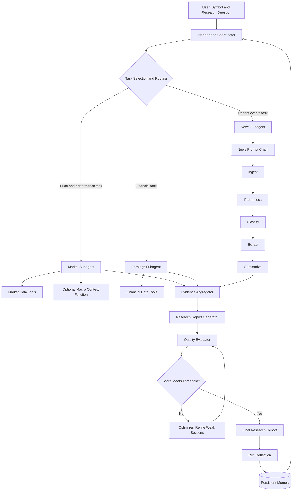

# Investment Research Agent Architecture

## 1. Purpose

This project implements a Python-based agentic AI system that researches a stock using market prices, financial statements, and recent news. The system demonstrates:

- **Workflow patterns:** Prompt Chaining, Routing, and Evaluator–Optimizer
- **Agent functions:** Planning, Dynamic Tool Use, Self-Reflection, and Learning Across Runs
- **Engineering quality:** Modular Python code, comments, logs, and visualizations

> The generated output is intended for educational research and is not personalized investment advice.

## 2. High-Level Architecture



## 3. Core Components

### 3.1 Planner and Coordinator

The Planner is the main orchestration component. It also performs the routing function, so a separate Router Agent is not required.

Responsibilities:

- Interpret the stock symbol and research question.
- Retrieve relevant lessons from previous runs.
- Decompose the request into research tasks.
- Select only the required subagents and tools.
- Define task dependencies and execution order.
- Record selected and skipped subagents with reasons.
- Combine specialist results for report generation.

A broad investment-research request may select all three subagents. A narrow request should select only the relevant subagent or subagents.

### 3.2 Market Subagent

Responsibilities:

- Retrieve historical stock and benchmark prices.
- Calculate returns and rolling volatility.
- Compare stock performance with a benchmark.
- Identify major market trends.
- Invoke macro-context analysis only when relevant.

Deterministic functions, such as return calculation and chart generation, remain ordinary Python functions rather than separate agents.

### 3.3 Earnings Subagent

Responsibilities:

- Retrieve income statements, balance sheets, and cash-flow statements.
- Calculate revenue, profit, margin, and cash-flow trends.
- Extract significant earnings observations.
- Identify financial strengths, risks, and limitations.
- Return findings with supporting evidence.

### 3.4 News Subagent

The News Subagent contains the required Prompt Chaining workflow:

1. **Ingest:** Retrieve recent company news.
2. **Preprocess:** Clean text, normalize dates, remove duplicates, and filter irrelevant items.
3. **Classify:** Categorize news by event type, relevance, and possible impact.
4. **Extract:** Extract events, dates, entities, figures, risks, catalysts, and sources.
5. **Summarize:** Produce an evidence-backed summary of important developments.

Each stage stores and displays its intermediate output in the notebook.

### 3.5 Optional Macro Context

Macro analysis is not a standalone agent. It is a conditional function under the Market Subagent.

Examples:

- Financial company: interest rates and Treasury yields
- Energy company: oil or natural-gas prices
- Consumer company: inflation and unemployment

The function must separate observed macroeconomic facts from possible company implications. It should be skipped when the research question does not require macroeconomic context.

### 3.6 Report Generator

The Report Generator combines specialist outputs into a consistent report containing:

- Executive summary
- Market analysis
- Financial analysis
- News and event analysis
- Relevant macro context, if selected
- Risks and catalysts
- Conflicting or incomplete evidence
- Confidence and limitations
- Sources and retrieval timestamps

### 3.7 Evaluator–Optimizer

The Evaluator assesses the draft report using a structured quality rubric:

- Evidence grounding
- Completeness
- Numeric consistency
- Source recency
- Risk and catalyst coverage
- Clarity
- Uncertainty disclosure

If the score is below the configured threshold, the Optimizer refines only the weak sections using evaluator feedback. Refinement is limited to a maximum number of cycles to prevent uncontrolled looping.

### 3.8 Reflection and Memory

After every run, the system records:

- Successful and failed steps
- Missing or weak evidence
- Tool failures
- Duplicate-news issues
- Evaluator feedback
- Recommended improvements

Compact lessons are stored in SQLite. During a later run, the Planner retrieves relevant lessons and adapts the plan. Stored memory supports planning but is never treated as current financial evidence.

## 4. Routing Design

Routing is implemented inside the Planner through an explicit task-selection step.

Example decisions:

- “Analyze one-year price performance” → Market Subagent
- “Analyze revenue and margin trends” → Earnings Subagent
- “Summarize recent product announcements” → News Subagent
- “Analyze earnings and the resulting share-price movement” → Earnings and Market Subagents
- “Produce comprehensive investment research” → All three subagents

Every routing decision records:

- Research task
- Selected subagent
- Selection reason
- Confidence
- Execution status
- Skipped subagents and reasons

Calling every subagent for every request is avoided because that represents a fixed pipeline rather than dynamic routing.

## 5. Data and Tool Layer

```text
Tool Registry
├── Company profile tool
├── Historical market data tool
├── Benchmark data tool
├── Financial statement tool
├── News retrieval tool
├── Optional filing tool
├── Optional macro-data tool
├── Memory retrieval tool
└── Memory storage tool
```

Each tool returns a structured result containing:

- Tool name
- Input parameters
- Status
- Execution duration
- Record count or output summary
- Error details, if any
- Retrieval timestamp

The agent continues with a partial report when a non-critical tool fails, while clearly showing a warning. It must not invent missing data.

## 6. Shared Agent State

```python
@dataclass
class AgentState:
    symbol: str
    research_question: str
    company_profile: dict | None
    plan: list
    selected_subagents: list
    routing_log: list
    tool_call_log: list
    market_result: dict | None
    earnings_result: dict | None
    news_result: dict | None
    evidence: list
    draft_report: dict | None
    evaluation_history: list
    final_report: dict | None
    memories_used: list
    warnings: list
```

The shared state makes planning, execution, evaluation, and memory usage inspectable in the notebook.

## 7. Standard Subagent Output

Each subagent returns a consistent structure:

```python
{
    "agent": "market_agent",
    "status": "success",
    "summary": "...",
    "findings": [],
    "evidence": [],
    "risks": [],
    "limitations": [],
    "visualization_data": {}
}
```

This interface allows the Report Generator to combine outputs without depending on agent-specific text formats.

## 8. Execution Flow

1. Accept the stock symbol and research question.
2. Validate the input and retrieve relevant memory.
3. Generate a structured research plan.
4. Select and route tasks to relevant subagents.
5. Execute approved tools and capture tool-call logs.
6. Run the News Prompt Chain when news analysis is selected.
7. Aggregate evidence from selected subagents.
8. Generate the initial research report.
9. Evaluate the report against the quality rubric.
10. Refine weak sections when required.
11. Produce the final report and visualizations.
12. Reflect on the run and store reusable lessons.

## 9. Notebook Demonstration

The Jupyter Notebook must visibly demonstrate the following:

### Workflow Patterns

- Prompt Chaining with outputs from all five news stages
- Routing through selected and skipped subagent decisions
- Evaluator–Optimizer through before-and-after reports and scores

### Agent Functions

- Planning through a generated research plan
- Dynamic Tool Use through tool-selection and execution logs
- Self-Reflection through structured run assessment
- Learning Across Runs through saved memory and an adapted second run

### Visualizations

- Stock and benchmark performance
- Rolling volatility
- Financial trends
- News processing funnel
- News category distribution
- Routing distribution
- Evaluation scores before and after refinement
- Quality score across repeated runs

## 10. Suggested Repository Structure

```text
investment-research-agent/
├── investment_research_agent.ipynb
├── architecture.md
├── README.md
├── requirements.txt
├── .env.example
├── src/
│   ├── __init__.py
│   ├── models.py
│   ├── planner.py
│   ├── orchestrator.py
│   ├── tools.py
│   ├── market_agent.py
│   ├── earnings_agent.py
│   ├── news_agent.py
│   ├── news_pipeline.py
│   ├── report_generator.py
│   ├── evaluator.py
│   ├── memory.py
│   └── visualizations.py
├── prompts/
│   ├── planner.txt
│   ├── news_classifier.txt
│   ├── news_extractor.txt
│   ├── news_summarizer.txt
│   ├── report_generator.txt
│   └── evaluator.txt
├── tests/
│   ├── test_planner.py
│   ├── test_routing.py
│   ├── test_news_pipeline.py
│   ├── test_evaluator.py
│   └── test_memory.py
└── outputs/
```

## 11. Engineer 1 Ownership

### Engineer 1 owns Planner and Agent Orchestration:

- Define the shared agent state and interfaces.
- Implement research-plan generation.
- Implement task decomposition and routing within the Planner.
- Maintain the subagent and tool registries.
- Execute selected subagents in the required order.
- Capture routing decisions and tool-call logs.
- Aggregate subagent outputs.
- Integrate the complete notebook execution flow.


### Engineer 2: Data and Specialist Subagents

Engineer 2 owns Data and Specialist Subagents:

- Integrate market, financial, news, and optional filing data.
- Implement Market and Earnings subagents.
- Implement the news prompt chain:
    - Ingest
    - Preprocess
    - Classify
    - Extract
    - Summarize
- Add data validation and API failure handling.

### Engineer 3: Evaluation, Memory, and Visualization

Engineer 3 owns Evaluation, Memory, and Visualization:

- Implement report generation.
- Implement evaluator–optimizer workflow.
- Implement self-reflection and quality scoring.
- Implement SQLite memory and second-run learning.
- Create charts, workflow visualizations, comments, documentation, and final demonstration.

## 12. Key Design Decisions

- Use one Planner/Coordinator instead of separate Planner and Router agents.
- Use three specialist subagents: Market, Earnings, and News.
- Keep macro analysis as a conditional Market function.
- Use ordinary Python functions for deterministic calculations.
- Preserve all intermediate workflow outputs for scoring evidence.
- Use structured models instead of passing unstructured text between components.
- Limit evaluator refinement cycles.
- Treat memory as planning guidance, not current evidence.
- Prefer a transparent custom Python workflow over a complex agent framework.
